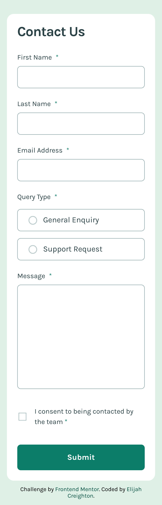
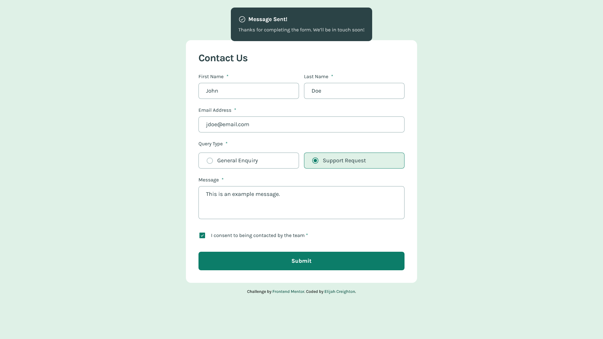

# Frontend Mentor - Contact form solution

This is a solution to the [Contact form challenge on Frontend Mentor](https://www.frontendmentor.io/challenges/contact-form--G-hYlqKJj).

## Table of contents

- [Overview](#overview)
  - [The challenge](#the-challenge)
  - [Screenshots](#screenshots)
  - [Links](#links)
- [My process](#my-process)
  - [Built with](#built-with)
  - [What I learned](#what-i-learned)
- [Author](#author)

## Overview

### The challenge

Users should be able to:

- [x] Complete the form and see a success toast message upon successful submission
- Receive form validation messages if:
  - [x] A required field has been missed
  - [x] The email address is not formatted correctly
- [x] Complete the form only using their keyboard
- [x] Have inputs, error messages, and the success message announced on their screen reader
- [x] View the optimal layout for the interface depending on their device's screen size
- [x] See hover and focus states for all interactive elements on the page

### Screenshots

### Links

- Solution URL: [Add solution URL here](https://creightoneli.github.io/)
- Live Site URL: [https://creightoneli.github.io/contact-form-FEM](https://creightoneli.github.io/contact-form-FEM)

## My process

### Built with

- Semantic HTML5 markup
- SCSS
- CSS custom properties
- Flexbox
- Mobile-first workflow

### What I learned

I learned a lot about form development and validation. I've done it before but it was a very nice refresher. I also tried out making sure it was more accessible. I think I helped but am somewhat unsure. I'll definitely look into it further in the future.

## Author

- Website - [creightoneli.github.io](https://creightoneli.github.io/)
- Frontend Mentor - [@CreightonEli](https://www.frontendmentor.io/profile/CreightonEli)
- Twitter - [@creightone_dev](https://x.com/creightone_dev)
- Instagram - [creightone.dev](https://www.instagram.com/creightone.dev/)